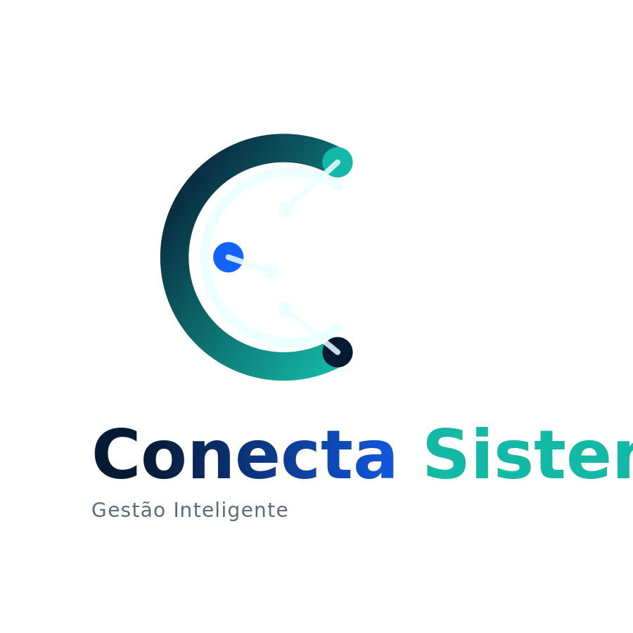

# 🌐 Conecta Sistemas — Site Institucional

> **Conecta Sistemas — Gestão Inteligente**  
> Site institucional da MS Frotas Administradora de Benefícios LTDA



---

## 🚀 Sobre

Site institucional bilíngue (PT-BR / EN) da **Conecta Sistemas**, empresa de tecnologia especializada em desenvolvimento e operação de sistemas corporativos para múltiplos segmentos:

- 🚛 **Gestão de Frotas** — Manutenção, abastecimento e rastreamento
- 🏢 **Gestão Imobiliária** — Contratos, cobranças e inquilinos
- 🍽️ **Gestão de Restaurantes** — Comandas, KDS, estoque e IA
- 🛒 **Gestão de Mercados** — PDV, estoque e fiscal
- 🏠 **Gestão de Condomínios** — Assembleias, cobranças e comunicação
- 📱 **Aplicativos Personalizados** — Mobile, Web e APIs

## 📋 Estrutura do Projeto

```
conecta-site/
├── index.html                    # Site completo (single-page)
├── assets/
│   ├── icons/                    # SVGs da marca e ícones de segmentos
│   │   ├── conecta-logo-stacked.svg
│   │   ├── conecta-symbol.svg
│   │   ├── conecta-app-icon.svg
│   │   ├── conecta-favicon.svg
│   │   ├── conecta-icon-apps.svg
│   │   ├── conecta-icon-condominios.svg
│   │   ├── conecta-icon-frotas.svg
│   │   ├── conecta-icon-imoveis-ativos.svg
│   │   ├── conecta-icon-intermediacoes.svg
│   │   ├── conecta-icon-mercados.svg
│   │   ├── conecta-icon-pagamentos.svg
│   │   └── conecta-icon-restaurantes.svg
│   └── images/                   # Imagens adicionais (logos de clientes, etc.)
├── .github/
│   └── workflows/
│       └── deploy.yml            # GitHub Actions — auto deploy
├── .gitignore
├── CNAME                         # Domínio customizado (editar)
└── README.md
```

## 🎨 Paleta de Cores (Tech)

| Cor | HEX | Uso |
|-----|------|-----|
| Navy | `#071A33` | Base / fundos escuros |
| Blue | `#1463FF` | Tecnologia / links / ações |
| Teal | `#14B8A6` | Acento / CTAs / destaque |
| Teal Light | `#5EEAD4` | Highlight / hover / glow |
| Ice | `#ECFEFF` | Fundo claro oficial |
| Ink | `#0F172A` | Texto principal |
| Slate | `#5A6B84` | Texto secundário |

## 🔤 Tipografia

- **Títulos:** Sora (700 / 800)
- **Corpo:** Inter (400 / 500 / 600)
- **Código:** JetBrains Mono (400 / 500)

## 🌍 Funcionalidades

- ✅ Site single-page com navegação por seções
- ✅ Bilíngue PT-BR / EN (toggle no nav)
- ✅ Totalmente responsivo (mobile, tablet, desktop)
- ✅ Animações: scroll reveal, particles, grid animado
- ✅ Portal do Cliente com cards para acesso aos sistemas
- ✅ Área de cadastro de fornecedores
- ✅ Formulário de contato
- ✅ Login para clientes
- ✅ Strip de logos de clientes (scroll infinito)
- ✅ SVGs inline — zero dependência externa

## 🚀 Deploy via GitHub Pages

### Opção 1: Automático (GitHub Actions)

O repositório já inclui `.github/workflows/deploy.yml`.  
Basta dar push na branch `main` e o site é publicado automaticamente.

### Opção 2: Manual

1. Vá em **Settings** > **Pages** no repositório
2. Em **Source**, selecione **Deploy from a branch**
3. Escolha `main` e `/` (root)
4. Clique **Save**
5. Aguarde ~2 min — o site estará em `https://seu-usuario.github.io/conecta-site/`

### Domínio Customizado

Para usar domínio próprio (ex: `www.conectasistemas.com.br`):

1. Edite o arquivo `CNAME` com seu domínio
2. Configure o DNS do domínio:
   - **CNAME record:** `www` → `seu-usuario.github.io`
   - **A records** (para apex domain):
     - `185.199.108.153`
     - `185.199.109.153`
     - `185.199.110.153`
     - `185.199.111.153`
3. Em **Settings** > **Pages**, insira o domínio

## 📝 Personalização

### Adicionar logos de clientes
Substitua os placeholders `<div class="client-placeholder">` na seção `#clients` por:
```html

```

### Adicionar links dos sistemas (Portal)
Edite os `href="#"` nos cards `portal-card` com os links reais.

### Adicionar telefone
Busque `Em breve` no HTML e substitua pelo número.

## 📫 Contato

**MS Frotas Administradora de Benefícios LTDA**  
Av. dos Autonomistas, 2561 — Centro, Osasco - SP  
📧 financeiro.msfrotas@gmail.com

---

© 2025 Conecta Sistemas — Gestão Inteligente. Todos os direitos reservados.
